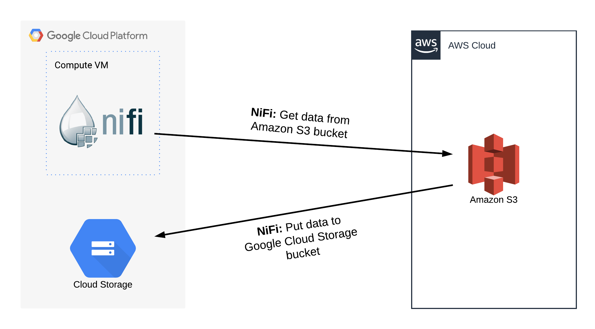
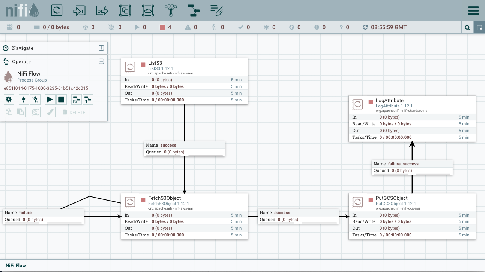

# Data Migration from Amazon S3 to Google Cloud Storage with Apache NiFi

| | |
|-|-|
|__Title__| Data Migration from Amazon S3 to Google Cloud Storage with Apache NiFi
|__Presenter__ | __Karis Bisong__  Cloud Data Engineer 
|__Website__ | <a href="https://karisb.ca">https://karisb.ca</a>

This project migrates data from Amazon S3 to Google Cloud Storage (GCS) using Apache NiFi. NiFi is an open-source Apache software tool for automating data flow between software systems.

The flow model on Apache NiFi is illustrated below.

